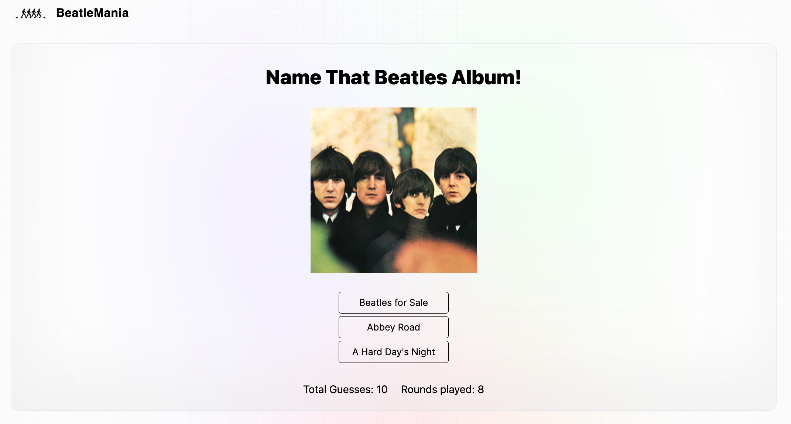

# BeatleMania - Beatles Albums Quiz App

BeatleMania is a web application designed to test your knowledge of The Beatles' album covers. Built with Next.js, this app provides an interactive quiz experience, challenging users to identify albums based on their cover art. Below, you'll find detailed instructions on setting up the project, running the app locally, and enhancing your experience.



## Features

- **Interactive Quiz:** Users can guess the correct Beatles album cover from multiple choices.
- **Dynamic Loading:** Album cover images are fetched asynchronously, showcasing React's capability to handle dynamic content.
- **Context API:** Utilizes React's Context API for state management across components.
- **Responsive Design:** Styled with TailwindCSS for a mobile-friendly, responsive layout.
- **Unit Testing:** Incorporates Jest and React Testing Library for robust testing of components.

## Tech Stack

- **Next.js:** A React framework for building single-page JavaScript applications with server-side rendering.
- **React:** A JavaScript library for building user interfaces.
- **Axios:** A promise-based HTTP client for making asynchronous requests.
- **TailwindCSS:** A utility-first CSS framework for rapid UI development.
- **Jest & React Testing Library:** Tools for writing and running unit and integration tests.

## Getting Started

### Prerequisites

- Node.js
- npm

### Installation

#### From GitHub

1. Clone the repository to your local machine:
   ```sh
   git clone https://github.com/max-mackie/Beatles-Albums
   ```
2. Navigate into the project directory:
   ```sh
   cd beatles_albums
   ```

#### From ZIP File

1. Download the ZIP file from the GitHub repository page.
2. Unzip the file to your desired location.
3. Open your terminal and navigate into the unzipped project directory.

### Install Dependencies

Install the project dependencies:
```sh
npm install
```

### Running the App

- **Development Mode:**
  Start the application in development mode with hot reloading:
  ```sh
  npm run dev
  ```
- **Production Build:**
  Build the application for production:
  ```sh
  npm run build
  ```
  and then start the production server:
  ```sh
  npm start
  ```
- **Running Tests:**
  Execute unit tests with Jest:
  ```sh
  npm run test
  ```
  or in watch mode:
  ```sh
  npm run test:watch
  ```

## Future Enhancements

- Improve Layout for Tablet Screens: Optimize the UI for a better experience on tablet devices.
- Add Next-Auth with Signup Page: Implement authentication to allow user signups and logins.
- Implement User Data in Database: Store user statistics for personalized feedback.
- Add Navbar Links to Sign In and Out: Enhance navigation with sign-in/out links.
- Social Sharing Options: Enable sharing of scores and trivia on social media.
- Leaderboard Feature: Introduce a leaderboard for a competitive edge.
- Customizable Quiz Options: Allow users to tailor the quiz experience.
- Mobile App Version: Expand the game's reach with a mobile app.
- Interactive Album Explorer: Offer an exploratory feature for Beatles discography.
- User Feedback System: Collect user feedback to improve the game.
- Achievements and Badges: Motivate users with a gamification system.


